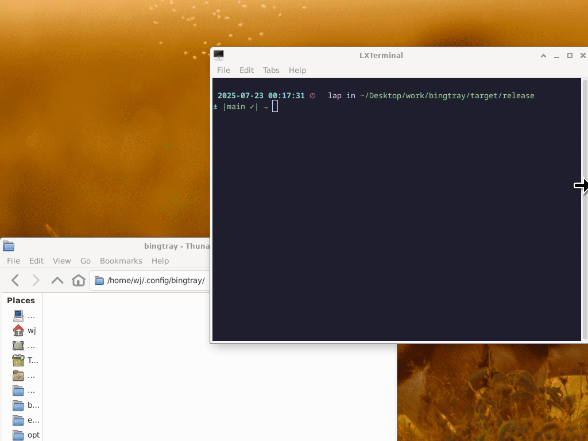

# BingTray - Bing Wallpaper Manager

A cross-platform wallpaper manager that downloads and manages Bing's weekly wallpapers.



## Project Structure

This project is organized as a Rust workspace with three packages:

- **`bingtray-core`**: Core library containing all the wallpaper management logic
- **`bingcli`**: Command-line interface application  
- **`bingtray-gui`**: GUI application that can also run as CLI when given arguments

## Usage

### CLI Application

Run the interactive CLI menu:
```bash
$ bingcli
```

### GUI Application

Run the GUI (currently falls back to CLI mode):
```bash
$ bingtray-gui
```

Run CLI from GUI binary:
```bash
# run cli application from gui binary
$ bingtray-gui --cli
```

- **Intelligent scheduling**: Downloads new wallpapers when needed (every 7 days per market)

## Configuration

The application creates configuration files in:
- Linux: `~/.config/bingtray/`

### Directory structure:
- `unprocessed/`: Downloaded wallpapers waiting to be used
- `keepfavorite/`: Wallpapers you've marked as favorites
- `blacklist.conf`: Hash list of blacklisted images
- `marketcodes.conf`: Market codes and last download timestamps

## Usage

After starting the application, you'll see a tray icon with the following options:

- **Next wallpaper**: Set the next available wallpaper from the unprocessed folder
- **Keep "[title]"**: Move the current wallpaper to favorites and set the next one
- **Blacklist "[title]"**: Remove the current wallpaper and add it to blacklist
- **Exit**: Close the application

## Supported Desktop Environments

- Windows
- Mac OSX
- GNOME/Unity/Cinnamon (via gsettings)
- MATE (via gsettings)
- XFCE4 (via xfconf-query)
- LXDE (via pcmanfm)
- Fluxbox/JWM/Openbox/AfterStep (via fbsetbg)
- IceWM (via icewmbg)
- Blackbox (via bsetbg)
