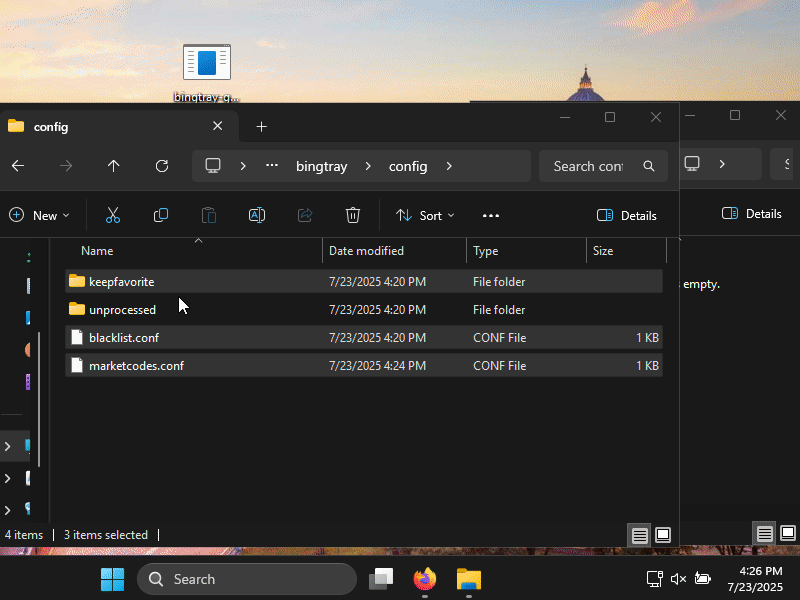

# BingTray - Bing Wallpaper Manager

Similar App : [Bigwallpaper Desktop](https://bingwallpaper.microsoft.com/Windows/bing/bing-wallpaper/)


A cross-platform wallpaper manager that downloads and manages Bing's weekly wallpapers. bing wallpapers are updated weekly in 43 global stores. each store has different sets of 8 images many of them are shared beween markets. We are visiting random market wallpaper list and download new images if we dont have them. If you exhausted all market images, you have wait for a week to get new images. 


## Download

| Arch          | Windows        | MacOS         | Linux        | Android        | IOS         |
|:--------------|:--------------:|:-------------:|:------------:|:--------------:|--------------:|
| X86_64(AMD64) | [CLI](https://github.com/nikescar/bingtray/releases/latest/download/bingcli-x86_64-pc-windows-msvc.tar.gz) \| [GUI](https://github.com/nikescar/bingtray/releases/latest/download/bingtray-gui-x86_64-pc-windows-msvc.tar.gz) | [CLI](https://github.com/nikescar/bingtray/releases/latest/download/bingcli-x86_64-apple-darwin.tar.gz) \| [GUI](https://github.com/nikescar/bingtray/releases/latest/download/bingtray-gui-x86_64-apple-darwin.tar.gz) | [CLI](https://github.com/nikescar/bingtray/releases/latest/download/bingcli-x86_64-unknown-linux-musl.tar.gz) \| [GUI](https://github.com/nikescar/bingtray/releases/latest/download/bingtray-gui-x86_64-unknown-linux-musl.tar.gz) | - | - |
| AARCH64(ARM64)| - | [CLI](https://github.com/nikescar/bingtray/releases/latest/download/bingcli-aarch64-apple-darwin.tar.gz) \| [GUI](https://github.com/nikescar/bingtray/releases/latest/download/bingtray-gui-aarch64-apple-darwin.tar.gz) | [CLI](https://github.com/nikescar/bingtray/releases/latest/download/bingcli-aarch64-unknown-linux-musl.tar.gz) \| [GUI](https://github.com/nikescar/bingtray/releases/latest/download/bingtray-gui-aarch64-linux-android.tar.gz) | [CLI](https://github.com/nikescar/bingtray/releases/latest/download/bingcli-aarch64-linux-android.tar.gz) \| [APK*](https://github.com/nikescar/bingtray/releases/latest/download/bingtray-and-aarch64-debug.apk ) | - |

[Latest Release](https://github.com/nikescar/bingtray/releases)<br/>
\* Only Debug Apk, at the moment.
<br/>
<br/>




## Usage

```bash
# Run the interactive CLI menu:
$ bingcli
# Run the GUI (currently falls back to CLI mode):
$ bingtray-gui
# Run cli application from gui binary
$ bingtray-gui --cli
```

## Configuration

The application creates configuration files in:
- Linux: `~/.config/bingtray/`
- MAC OSX: `/Users/{Username}/Library/Application Support/bingtray`
- Windows: `C:\Users\{Username}\Appdata\Roaming\bingtray`

### Directory structure:
- `unprocessed/`: Downloaded wallpapers waiting to be used
- `keepfavorite/`: Wallpapers you've marked as favorites
- `blacklist.conf`: Hash list of blacklisted images
- `marketcodes.conf`: Market codes and last download timestamps

## Usage

After starting the application, you'll see a tray icon with the following options:
- **0. Cache Dir Contents**: Open folder image and configs are saved
- **1. Next Market wallpaper**: Set the next available wallpaper from the unprocessed folder
- **2. Keep "[title]"**: Move the current wallpaper to favorites and set the next one
- **3. Blacklist "[title]"**: Remove the current wallpaper and add it to blacklist
- **4. Next Kept Wallpaper**: Get Next Kept Wallpaper 
- **5. Exit**: Close the application

## Supported Desktop Environments

- **Windows**: Via winapi
- **Mac OSX**: Via AppleScript
- **GNOME/Unity/Cinnamon**: Via gsettings
- **MATE**: Via gsettings
- **XFCE4**: Via xfconf-query
- **LXDE**: Via pcmanfm
- **Fluxbox/JWM/Openbox/AfterStep**: Via fbsetbg
- **IceWM**: Via icewmbg
- **Blackbox**: Via bsetbg

<details markdown>
<summary> Todos </summary>

## Todos
* two folders open error
* add historical bing images from https://raw.githubusercontent.com/v5tech/bing-wallpaper/refs/heads/main/bing-wallpaper.md
https://github.com/niumoo/bing-wallpaper/tree/main
* add version to app and check update
* download progress on gui
* remove windws i686 build due to virustotal detected - https://www.virustotal.com/gui/file-analysis/MTVlM2Q3MzFmMzNlMWM4MGVjNmNhNTNmM2Q3MjZjMzE6MTc1MzI1NzA0OA==
* xbuild errors : apk signing error
* osx x86_64 build : zsh: bad CPU type in executable.
* add apk for x86_64 build.
* xbuild error for x86_64 build. """ $ x build --arch x64 --platform android """
```
error: linking with `clang` failed: exit status: 1
  |
  = note:  "clang" "-Wl,--version-script=/tmp/rustc0NNvfG/list" "-Wl,--no-undefined-version" "-m64" "/tmp/rustc0NNvfG/symbols.o" "<152 object files omitted>" "-Wl,--as-needed" "-Wl,-Bstatic" "/home/wj/Desktop/work/bingtray/target/x/debug/android/x64/cargo/x86_64-linux-android/debug/deps/{libandroid_logger-399c64897acef08f.rlib,libenv_filter-deef0f7108700fc2.rlib,libandroid_log_sys-e40be7d5b33d9f98.rlib,libegui_extras-f2730d8aa7bd4d8f.rlib,libenum_map-74d0e37992ff8186.rlib,libserde_json-265009d7db391f6a.rlib,libitoa-3bd4074db569c96a.rlib,libryu-d198640a5d515fd8.rlib,libehttp-39931845fcfd2e00.rlib,libureq-7e900446e63f1f3f.rlib,libwebpki_roots-673a08af2cabd49e.rlib,libwebpki_roots-35a554f8c0405cdf.rlib,libbase64-34ab435ce034b9c5.rlib,librustls-7ca6f1a335173068.rlib,libsubtle-d74d88983aca206e.rlib,libwebpki-c98ca1a8d8219093.rlib,libring-fa1bd7a1299ab9de.rlib,libgetrandom-28bae299ee7d22c4.rlib,libuntrusted-20920f72646b241a.rlib,librustls_pki_types-b55f3107757cd644.rlib,libzeroize-327cc33350dee8b9.rlib,libpoll_promise-88194be483f7d762.rlib,libeframe-7ba5110ce87a9f1f.rlib,libimage-85b31934fc84c44e.rlib,libimage_webp-41ec6a1d3aeb935c.rlib,libqoi-d3152ea197da2f04.rlib,libpng-0c1e68b7312832a1.rlib,libbitflags-7d8531ac1bf0d08e.rlib,libfdeflate-60542544759da69b.rlib,libexr-e0233f0e10a08754.rlib,libzune_inflate-7698559e0572557b.rlib,libbit_field-08587b0e133d5fda.rlib,liblebe-d88578b5e1044cb7.rlib,libhalf-ae932a8d74340ea4.rlib,libzune_jpeg-7299df037006bf6d.rlib,libzune_core-3d889eab825aeb51.rlib,libgif-048f0e14e6a50107.rlib,libcolor_quant-1d1c3800ffd78361.rlib,libbyteorder_lite-bf8d6e78086a4343.rlib,libravif-6274a79ed4dfbf02.rlib,libloop9-5eee4500c9d512e6.rlib,libavif_serialize-ca2e917c8ef370da.rlib,libquick_error-754785774904f11d.rlib,librgb-882907614fb6b452.rlib,librav1e-3f16b4da3f606f43.rlib,libav1_grain-1b3086d9c01b8026.rlib,libnom-dd6e1cd52c7dff6d.rlib,libnum_rational-22696fcea10fca57.rlib,libnum_bigint-a82ba9037eb42616.rlib,libnum_integer-6ba6d692dc4ea284.rlib,libanyhow-bfcd3f725269cfb4.rlib,libdebug_unreachable-c0025f725c787cde.rlib,libmaybe_rayon-b9f059c30b167e2c.rlib,librayon-5dcc3a02224d9589.rlib,librayon_core-4a59de311bb33b63.rlib,libcrossbeam_deque-a450c64bed25e064.rlib,libcrossbeam_epoch-9d28f0f6cdaac6f3.rlib,libcrossbeam_utils-b7b5bb77ecf2040d.rlib,libv_frame-e229d64a54fdd01e.rlib,libaligned_vec-ac10a47413b709a2.rlib,libequator-6707061eadfc7071.rlib,libbitstream_io-f7cbb1898eb31c2c.rlib,libitertools-cd24c51258148bfc.rlib,libeither-45d3a180f446f5cb.rlib,libimgref-5ca7f3be2eb12230.rlib,libtiff-3859232a0e953e96.rlib,libflate2-48579c7672d4db4e.rlib,libminiz_oxide-67e90246825e617e.rlib,libsimd_adler32-ed13544f0b898673.rlib,libcrc32fast-7c767f460c28bdc3.rlib,libweezl-58c025d2e4804705.rlib,libjpeg_decoder-d0560d70df94ab29.rlib,libpollster-9593cb7c3621558f.rlib,libglutin_winit-4858eab39cf7da68.rlib,libglutin-33ba9a3550cb5064.rlib,libglutin_egl_sys-c90e854b91339a19.rlib,libegui_winit-541e7779b45ff24e.rlib,libwebbrowser-91b06627a1401ad3.rlib,liburl-30de1cb6f44390d0.rlib,libidna-bd1d487927116b38.rlib,libutf8_iter-7b60687b12b188bf.rlib,libidna_adapter-d0257a2997a4d80c.rlib,libicu_properties-5511cba6af326b6c.rlib,libicu_properties_data-83cdffdb3a25ad6e.rlib,libicu_normalizer-d380059ec9d5bfb0.rlib,libicu_normalizer_data-950369fd83fb59a9.rlib,libicu_collections-18696d85c26bee72.rlib,libpotential_utf-55622d68e5369abd.rlib,libicu_provider-3bf2a6cade1c23ac.rlib,libicu_locale_core-d10bbd54542d59cb.rlib,libtinystr-aeaca047383e6353.rlib,liblitemap-decaae8e0e0b8e7a.rlib,libwriteable-9f122e8a496adc9a.rlib,libzerovec-9219339e1bdef588.rlib,libzerotrie-8a7960d82211efd8.rlib,libyoke-e5690b49446f9e17.rlib,libstable_deref_trait-59bdbed2f0d71f5f.rlib,libzerofrom-e5c56e1c523a1d30.rlib,libform_urlencoded-2602b54ca4d58af1.rlib,libpercent_encoding-eee4805c84f28f26.rlib,libaccesskit_winit-54c006b10ca9bd2a.rlib,libegui_wgpu-246e6e4ceb57f540.rlib,libweb_time-37214fbd6d4bb703.rlib,libwinit-26812ff6a4243359.rlib,libtracing-d15951959e8d50ce.rlib,libpin_project_lite-01a681d03049c324.rlib,libtracing_core-4ae3347d54549482.rlib,libandroid_activity-449afb77b2720933.rlib,libandroid_properties-977253171f5eb8ab.rlib,libndk_context-6cd792e7d8b47b0a.rlib,libjni-0725321aa1f5a31c.rlib,libcesu8-061fbd96a82ebe46.rlib,libcombine-c5a1626157469405.rlib,libmemchr-c88ea0c0808b96c4.rlib,libbytes-d06206304327d5ca.rlib,libndk-5ab633ffef0821e5.rlib,libndk_sys-d8792250e4122271.rlib,libnum_enum-7558c80e73861089.rlib,libsmol_str-264f6a9cb646c8f8.rlib,libcursor_icon-fc8f8fb08d1da545.rlib,libdpi-122d937d6565c797.rlib,libtype_map-ce84029e16dbf012.rlib,librustc_hash-722919d70991b719.rlib,libthiserror-1b80d9df7c35663b.rlib,libwgpu-de7efe278bb2e54f.rlib,libstatic_assertions-94af2406ad726919.rlib,libwgpu_core-d0ffa96203ca2274.rlib,libwgpu_hal-ae6cb65ff35c563d.rlib,librenderdoc_sys-0e77eeab9261d3db.rlib,libandroid_system_properties-12eee70fcab0e216.rlib,libndk_sys-de221db2eb51b006.rlib,libjni_sys-b4be15264844e465.rlib,libkhronos_egl-cd44af0a76d6b443.rlib,libordered_float-3048c2894bb6a336.rlib,libnum_traits-24f3462d01c76716.rlib,libgpu_descriptor-cfa821a9705b8142.rlib,libgpu_descriptor_types-3c15d2e666561240.rlib,libgpu_alloc-8042e75dc2ce2ca6.rlib,libgpu_alloc_types-5365439b914bcbcd.rlib,libash-e8a59fcf2ffc4b0f.rlib,liblibloading-739e6695b701cad4.rlib,libnaga-ece70ddf2bc53326.rlib,librustc_hash-71393d5d6fb4f890.rlib,libhexf_parse-11bba8d95b5b4f17.rlib,libunicode_xid-07e61b4f64c4d4b0.rlib,libbit_set-9d4cc1b1bf1e09d6.rlib,libbit_vec-7ab265a0f1d2e551.rlib,libstrum-82c088ff209e02f3.rlib,libcodespan_reporting-85c75ddb53e17e04.rlib,libunicode_width-7ab2a4028bdd2566.rlib,libtermcolor-2cbe5a6751f1ab81.rlib,libindexmap-1d58099ace528109.rlib,libequivalent-2d5db763e98ea159.rlib,libhashbrown-d32f850f1f085117.rlib,libfoldhash-bc639c1be2aec485.rlib,libspirv-cddb985ba8106f0c.rlib,libthiserror-b319d83006b33b3e.rlib,libarrayvec-78b7dfa82b67064d.rlib,libraw_window_handle-ddc983ad3a6ac670.rlib,libwgpu_types-eb3eae7151f60730.rlib,libegui_glow-0b6433f5876b32bd.rlib,libmemoffset-b1f4560d8f5f515c.rlib,libglow-5db39a63f507f17c.rlib,libegui-86e70e6ce2e079ba.rlib,libbitflags-bc9b2c2e83d45816.rlib,libserde-36dbbd774e9adf40.rlib,libaccesskit-bef1c96ed1f495bd.rlib,libepaint-90b59e29e0f97f2e.rlib,libnohash_hasher-1f1996960c1f2029.rlib,liblog-d13d534354c512bc.rlib,libprofiling-ff3348d753864099.rlib,libahash-71243cdfede2cb16.rlib,libgetrandom-48f4cbba7ddc9bd3.rlib,libonce_cell-1c74d1af165dacf5.rlib,libzerocopy-4948af45e7e68f85.rlib,libepaint_default_fonts-ead9b021369ffc13.rlib,libab_glyph-3921d4a4af93fd7d.rlib,libowned_ttf_parser-9a41455fdfa4449c.rlib,libttf_parser-c59d9a1e7cda8d28.rlib,libab_glyph_rasterizer-4a8ba87d975c20c3.rlib,libparking_lot-f647e3096fb10d5c.rlib,libparking_lot_core-497310dc846c29fb.rlib,liblibc-d3222f1edd18230c.rlib,libcfg_if-0646be82d7ae3aec.rlib,libsmallvec-94000ba5eecff2b1.rlib,liblock_api-9fae31873d78d733.rlib,libscopeguard-0381d73e8790bbd3.rlib,libecolor-25a4d82ae583e5df.rlib,libemath-c13a3335bb031933.rlib,libbytemuck-0ff1a16660bc163c.rlib}.rlib" "<sysroot>/lib/rustlib/x86_64-linux-android/lib/{libstd-*,libpanic_unwind-*,libobject-*,libmemchr-*,libaddr2line-*,libgimli-*,librustc_demangle-*,libstd_detect-*,libhashbrown-*,librustc_std_workspace_alloc-*,libminiz_oxide-*,libadler2-*,libunwind-*,libcfg_if-*,liblibc-*,liballoc-*,librustc_std_workspace_core-*,libcore-*,libcompiler_builtins-*}.rlib" "-Wl,-Bdynamic" "-llog" "-landroid" "-landroid" "-ldl" "-ldl" "-llog" "-lunwind" "-ldl" "-lm" "-lc" "-L" "/tmp/rustc0NNvfG/raw-dylibs" "-Wl,--eh-frame-hdr" "-Wl,-z,noexecstack" "-L" "/home/wj/Desktop/work/bingtray/target/x/debug/android/x64/cargo/x86_64-linux-android/debug/build/ring-3e8e838eb19c5064/out" "-o" "/home/wj/Desktop/work/bingtray/target/x/debug/android/x64/cargo/x86_64-linux-android/debug/deps/libbingtray_and.so" "-Wl,--gc-sections" "-shared" "-Wl,-z,relro,-z,now" "-nodefaultlibs" "--sysroot=/home/wj/.cache/x/Android.ndk" "-fuse-ld=lld" "--target=aarch64-linux-android" "-B/home/wj/.cache/x/Android.ndk/usr/lib/x86_64-linux-android/33" "-L/home/wj/.cache/x/Android.ndk/usr/lib/x86_64-linux-android/33" "-L/home/wj/.cache/x/Android.ndk/usr/lib/x86_64-linux-android"
  = note: some arguments are omitted. use `--verbose` to show all linker arguments
  = note: ld.lld: error: /home/wj/.cache/x/Android.ndk/usr/lib/x86_64-linux-android/33/crtbegin_so.o is incompatible with aarch64linux
          ld.lld: error: /tmp/rustc0NNvfG/symbols.o is incompatible with aarch64linux
          ld.lld: error: /home/wj/Desktop/work/bingtray/target/x/debug/android/x64/cargo/x86_64-linux-android/debug/deps/bingtray_and.00tnwvahs3tezcdckr95vqidt.10q63s9.rcgu.o is incompatible with aarch64linux
          ld.lld: error: /home/wj/Desktop/work/bingtray/target/x/debug/android/x64/cargo/x86_64-linux-android/debug/deps/bingtray_and.01uvqivldptwm5x9nswikqang.10q63s9.rcgu.o is incompatible with aarch64linux
          ld.lld: error: /home/wj/Desktop/work/bingtray/target/x/debug/android/x64/cargo/x86_64-linux-android/debug/deps/bingtray_and.02lpjwx6iuyox3lepl3u0qhjb.10q63s9.rcgu.o is incompatible with aarch64linux
          ld.lld: error: /home/wj/Desktop/work/bingtray/target/x/debug/android/x64/cargo/x86_64-linux-android/debug/deps/bingtray_and.06g5sgaruiwe699o71lotgn8d.10q63s9.rcgu.o is incompatible with aarch64linux
          ld.lld: error: /home/wj/Desktop/work/bingtray/target/x/debug/android/x64/cargo/x86_64-linux-android/debug/deps/bingtray_and.0fdtw5191h9myboqcky2vr1yc.10q63s9.rcgu.o is incompatible with aarch64linux
          ld.lld: error: /home/wj/Desktop/work/bingtray/target/x/debug/android/x64/cargo/x86_64-linux-android/debug/deps/bingtray_and.0jc766esaed0tu6g82om9mzlk.10q63s9.rcgu.o is incompatible with aarch64linux
          ld.lld: error: /home/wj/Desktop/work/bingtray/target/x/debug/android/x64/cargo/x86_64-linux-android/debug/deps/bingtray_and.0lejo08fg0ma3rl4va3bdypqc.10q63s9.rcgu.o is incompatible with aarch64linux
          ld.lld: error: /home/wj/Desktop/work/bingtray/target/x/debug/android/x64/cargo/x86_64-linux-android/debug/deps/bingtray_and.0tyi3epocd3gwobjtwka7ietb.10q63s9.rcgu.o is incompatible with aarch64linux
          ld.lld: error: /home/wj/Desktop/work/bingtray/target/x/debug/android/x64/cargo/x86_64-linux-android/debug/deps/bingtray_and.0vlx1f0725irvke7p8r4t0ww6.10q63s9.rcgu.o is incompatible with aarch64linux
          ld.lld: error: /home/wj/Desktop/work/bingtray/target/x/debug/android/x64/cargo/x86_64-linux-android/debug/deps/bingtray_and.0y7g10ceq09tvdao0j2xo61ml.10q63s9.rcgu.o is incompatible with aarch64linux
          ld.lld: error: /home/wj/Desktop/work/bingtray/target/x/debug/android/x64/cargo/x86_64-linux-android/debug/deps/bingtray_and.13s0f1dfnfw0y4tdz2hly2h3l.10q63s9.rcgu.o is incompatible with aarch64linux
          ld.lld: error: /home/wj/Desktop/work/bingtray/target/x/debug/android/x64/cargo/x86_64-linux-android/debug/deps/bingtray_and.15bz7gxf7196lj0r008588tac.10q63s9.rcgu.o is incompatible with aarch64linux
          ld.lld: error: /home/wj/Desktop/work/bingtray/target/x/debug/android/x64/cargo/x86_64-linux-android/debug/deps/bingtray_and.1b3dfuocb3j1u6ybeh88nvjwg.10q63s9.rcgu.o is incompatible with aarch64linux
          ld.lld: error: /home/wj/Desktop/work/bingtray/target/x/debug/android/x64/cargo/x86_64-linux-android/debug/deps/bingtray_and.1gaev3ablxhbpwai4bkqu5p40.10q63s9.rcgu.o is incompatible with aarch64linux
          ld.lld: error: /home/wj/Desktop/work/bingtray/target/x/debug/android/x64/cargo/x86_64-linux-android/debug/deps/bingtray_and.1oneag9axguche13f0vbnz6iq.10q63s9.rcgu.o is incompatible with aarch64linux
          ld.lld: error: /home/wj/Desktop/work/bingtray/target/x/debug/android/x64/cargo/x86_64-linux-android/debug/deps/bingtray_and.1s3pg0b5d9dzqownluk2asevl.10q63s9.rcgu.o is incompatible with aarch64linux
          ld.lld: error: /home/wj/Desktop/work/bingtray/target/x/debug/android/x64/cargo/x86_64-linux-android/debug/deps/bingtray_and.1sbb361s7eiu5ykb4om1tphtm.10q63s9.rcgu.o is incompatible with aarch64linux
          ld.lld: error: /home/wj/Desktop/work/bingtray/target/x/debug/android/x64/cargo/x86_64-linux-android/debug/deps/bingtray_and.1w49op7refbzaqvm4h1qgrimv.10q63s9.rcgu.o is incompatible with aarch64linux
          ld.lld: error: too many errors emitted, stopping now (use --error-limit=0 to see all errors)
          clang: error: linker command failed with exit code 1 (use -v to see invocation)
          

warning: `bingtray-and` (lib) generated 14 warnings
error: could not compile `bingtray-and` (lib) due to 1 previous error; 14 warnings emitted
```

</details>
