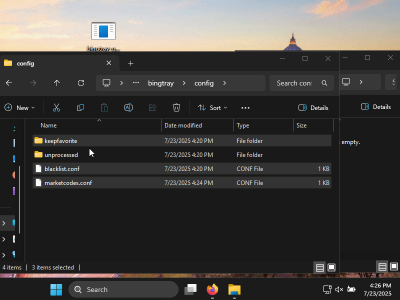

# BingTray - Bing Wallpaper Manager

Similar App : [Bigwallpaper Desktop](https://bingwallpaper.microsoft.com/Windows/bing/bing-wallpaper/)


A cross-platform wallpaper manager that downloads and manages Bing's weekly wallpapers. bing wallpapers are updated weekly in 43 global stores. each store has different sets of 8 images many of them are shared beween markets. We are visiting random market wallpaper list and download new images if we dont have them. If you exhausted all market images, you have wait for a week to get new images. 


## Download

| Arch          | Windows        | MacOS         | Linux        | Android        | IOS         |
|:--------------|:--------------:|:-------------:|:------------:|:--------------:|--------------:|
| X86_64(AMD64) | [GUI](https://github.com/nikescar/bingtray/releases/latest/download/bingtray-x86_64-pc-windows-msvc.tar.gz) | [GUI](https://github.com/nikescar/bingtray/releases/latest/download/bingtray-x86_64-apple-darwin.tar.gz) | [GUI](https://github.com/nikescar/bingtray/releases/latest/download/bingtray-x86_64-unknown-linux-musl.tar.gz) | [APK](https://github.com/nikescar/bingtray/releases/latest/download/bingtray-all-signed.apk ) | - |
| AARCH64(ARM64)| - | [GUI](https://github.com/nikescar/bingtray/releases/latest/download/bingtray-aarch64-apple-darwin.tar.gz) | [GUI](https://github.com/nikescar/bingtray/releases/latest/download/bingtray-aarch64-linux-android.tar.gz) | [APK](https://github.com/nikescar/bingtray/releases/latest/download/bingtray-all-signed.apk ) | - |

[Latest Release](https://github.com/nikescar/bingtray/releases)<br/>
<br/>
<br/>




## Usage

```bash
# Run in terminal cli mode will open, if you run in gui tray app will open.
$ bingtray
```

## Configuration

The application creates configuration files in:
- Linux: `~/.config/bingtray/`
- MAC OSX: `/Users/{Username}/Library/Application Support/bingtray`
- Windows: `C:\Users\{Username}\Appdata\Roaming\bingtray`

### Directory structure:
- `unprocessed/`: Downloaded wallpapers waiting to be used
- `keepfavorite/`: Wallpapers you've marked as favorites
- `blacklist.conf`: Hash list of blacklisted images
- `marketcodes.conf`: Market codes and last download timestamps

## Usage

After starting the application, you'll see a tray icon with the following options:
- **0. Cache Dir Contents**: Open folder image and configs are saved
- **1. Next Market wallpaper**: Set the next available wallpaper from the unprocessed folder
- **2. Keep "[title]"**: Move the current wallpaper to favorites and set the next one
- **3. Blacklist "[title]"**: Remove the current wallpaper and add it to blacklist
- **4. Next Kept Wallpaper**: Get Next Kept Wallpaper 
- **5. Exit**: Close the application

## Supported Desktop Environments

- **Windows**: Via winapi
- **Mac OSX**: Via AppleScript
- **GNOME/Unity/Cinnamon**: Via gsettings
- **MATE**: Via gsettings
- **XFCE4**: Via xfconf-query
- **LXDE**: Via pcmanfm
- **Fluxbox/JWM/Openbox/AfterStep**: Via fbsetbg
- **IceWM**: Via icewmbg
- **Blackbox**: Via bsetbg
- **Android** : Android 5 Lolipop -  Android 16 Baklava

<details markdown>
<summary> Todos </summary>

## Todos
* add version to app and check update
* download progress on gui
* remove windws i686 build due to virustotal detected - https://www.virustotal.com/gui/file-analysis/MTVlM2Q3MzFmMzNlMWM4MGVjNmNhNTNmM2Q3MjZjMzE6MTc1MzI1NzA0OA==
* initial bingtray, on long running workflow, tray menu is not well initialized. put menu into different thread.
* windows exe signing 
```
'$SignTool = Get-ChildItem -Path "C:\\Program Files*\\Windows Kits\\*\\bin\\*\\x64\\signtool.exe" -Recurse -ErrorAction SilentlyContinue | Select-Object -First 1',
"$SignToolPath = $SignTool.FullName",
"& $SignToolPath verify /pa /v target\\release\\test.exe",
```
* adroid widgets.
* ios widgets.

</details>
